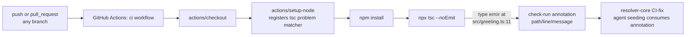

There are no runtime services here — the "architecture" is the CI job that
turns a type error into a check-run annotation.

- The `tsc` problem matcher registered by `setup-node` (see
  `.github/workflows/ci.yml:14-16`) is what converts a raw compiler error into
  a structured `{path, line, message}` annotation — that annotation is the
  actual "output" this fixture exists to produce.
- `tests/journeys/scripts/provision-ci-red-fixtures.ts` (referenced in
  README.md, not present in this repo) re-provisions/resets this fixture from
  the outside; it is not part of this repo's own build.
