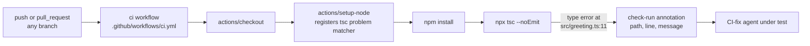

The repo has one moving part: a single GitHub Actions job that typechecks the
one source file.

Notes on non-obvious edges:

- `actions/setup-node@v4` (ci.yml:17-19) is what registers the built-in `tsc`
  problem matcher — without it, `tsc`'s stderr output would just be plain
  text in the log instead of structured `{path, line, message}` check-run
  annotations. That structured annotation is the actual interface the
  external CI-fix agent consumes, per the comment at ci.yml:14-16.
- `npx tsc --noEmit` (ci.yml:21) duplicates the `typecheck` script defined in
  package.json:7 rather than invoking `npm run typecheck` — if you ever
  consolidate these, keep the flags (`--noEmit`) identical so behavior
  doesn't change.
- The workflow triggers on push to `branches: ['**']` (ci.yml:5) and on all
  pull requests, so both the "main stays red" and "PR branch gets fixed"
  invariants in [[overview]] run through this same single job definition —
  there is no branch-conditional logic in the workflow itself.
