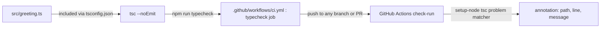

The `ci` workflow runs on every push (`branches: ['**']`) and every pull
request — there's no branch filtering, so the red `main` state and any PR
branch both trigger the same single `typecheck` job. `actions/setup-node@v4`
registers the built-in `tsc` problem matcher specifically so type errors
surface as structured check-run annotations (`{path, line, message}`) rather
than raw log text — that's the signal format the fix-agent journey expects,
per the comment in `.github/workflows/ci.yml:14-16`.
