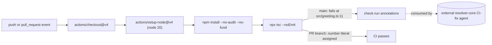

There are no services or modules in this repo beyond the CI pipeline itself and the single file it type-checks.

`actions/setup-node` registers the `tsc` problem matcher (see the comment above it in `../../.github/workflows/ci.yml`), which is what turns raw `tsc` stderr into structured `{path, line, message}` check-run annotations — that's the signal node `F` represents, and it's what the external CI-fix agent (node `H`, not part of this repo) reads.

The `main` and PR-branch outcomes (`F` vs `G`) are two paths through the same job, not two different workflows — see `../../README.md` for which one is expected on which branch.
