```mermaid
flowchart LR
    Push["push / pull_request\n(any branch)"] --> Job["ci workflow\ntypecheck job (ubuntu-latest)"]
    Job --> Checkout["actions/checkout@v4"]
    Checkout --> SetupNode["actions/setup-node@v4\nnode 20 + tsc problem matcher"]
    SetupNode --> Install["npm install"]
    Install --> Tsc["npx tsc --noEmit\n(tsconfig.json → src/**)"]
    Tsc -->|"src/greeting.ts:11 type error"| Annotation["check-run annotation\n{path, line, message}"]
    Annotation --> Consumer["resolver-core CI-fix\nagent seeding"]
```

The whole system is one GitHub Actions job (.github/workflows/ci.yml). `setup-node@v4` registers the `tsc` problem matcher before the typecheck step runs, so the type error at `src/greeting.ts:11` surfaces as a structured check-run annotation rather than plain log text — that annotation is the actual signal the downstream CI-fix agent consumes, per the inline comment in ci.yml:14-16.
